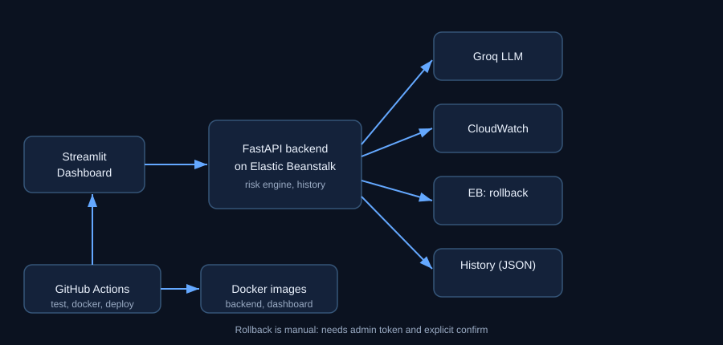

# DeployGuard

AI-assisted deployment risk and rollback helper, built for the **Build on Elastic Beanstalk Hackathon by TrainWithShubham**.

Give it error rate, latency and health. It scores the release (LOW / MEDIUM / HIGH) with deterministic rules, then an LLM explains what to investigate and whether to consider a rollback.



## Components
| Part | Tech | File |
|---|---|---|
| Risk engine + API | FastAPI | `app/main.py`, `app/risk.py` |
| AI diagnosis | Groq (`openai/gpt-oss-120b`, configurable) | `app/diagnosis.py` |
| Live metrics | AWS CloudWatch via boto3 | `app/cloudwatch.py` |
| Manual rollback | Elastic Beanstalk API, admin token + confirm | `app/rollback.py` |
| Dashboard | Streamlit | `app/dashboard.py` |
| History | local JSON (development storage only) | `app/history.py` |
| CI/CD | GitHub Actions | `.github/workflows/ci-cd.yml` |
| Containers | Docker, docker-compose | `Dockerfile`, `Dockerfile.dashboard` |

## Status (what is verified)
| Feature | Status |
|---|---|
| Risk scoring, validation, history, simulate | Automated tests (pytest) |
| CloudWatch calculation logic, rollback safety logic | Unit tests with mocked AWS |
| Elastic Beanstalk deployment of the backend | Deployed; `/health` checked |
| Docker build + container health check | Runs in CI (see Actions tab for result) |
| AI diagnosis on live AWS | Requires `eb setenv GROQ_API_KEY=...`; verify manually |
| Real CloudWatch data, real rollback | NOT verified against live AWS yet |

## Run locally
```
python -m venv .venv
.venv\Scripts\activate
pip install -r requirements-dev.txt
copy .env.example .env      # edit .env, never commit it
uvicorn app.main:app --reload
streamlit run app/dashboard.py
```
API docs: http://127.0.0.1:8000/docs   Dashboard: http://localhost:8501

## Tests
```
python -m pytest -q
```

## Docker
```
docker compose up --build
```
Backend: http://localhost:8000, dashboard: http://localhost:8501 (needs `.env`).

## Deploy to Elastic Beanstalk
```
eb init deployguard --platform python-3.11 --region ap-south-1
eb create deployguard-env --single -i t3.micro
eb setenv GROQ_API_KEY=... GROQ_MODEL=openai/gpt-oss-120b AWS_REGION=ap-south-1 EB_ENVIRONMENT_NAME=deployguard-env
eb deploy        # after each committed change
eb terminate deployguard-env   # when finished, to stop charges
```
Point the dashboard at it: `set DEPLOYGUARD_API_URL=http://<your-env>.elasticbeanstalk.com`

## CI/CD pipeline
`.github/workflows/ci-cd.yml`:
1. **test**: pytest
2. **docker-build**: builds both images, runs the backend container, checks `/health`
3. **deploy** (manual, or automatic on push to `main` when repo variable `AUTO_DEPLOY=true`): zips the app, registers an application version, updates the environment, runs a `/health` smoke test

Repo secrets needed for deploy: `AWS_ACCESS_KEY_ID`, `AWS_SECRET_ACCESS_KEY` (an IAM user with Elastic Beanstalk and S3 access).

## Security notes
- `/rollback` is disabled unless `DEPLOYGUARD_ADMIN_TOKEN` is set; it needs the `X-Admin-Token` header and `confirm=true`.
- `/diagnose` has a global rate limit (`DG_DIAG_RATE_PER_MIN`, default 10) to protect the LLM quota on a public URL.
- The EB instance role does not have CloudWatch/EB permissions by default, so `/metrics/live` and `/rollback` are meant to be run from a backend that has your AWS credentials (local), unless you add the permissions to the instance role.
- Secrets live in `.env` locally and `eb setenv` on AWS. `.env` is gitignored.

## Known limitations
- Risk weights are simple heuristics, not learned.
- History is a local JSON file and resets on redeploy or restart.
- AI output is advisory only; it never triggers actions.
